# homelab

hey there 👋🏻 this is my home lab. there are many like it, but this one is mine.

[peace be the journey](https://youtu.be/fu_6DXHut-Y?si=fUSLJ6zVKgsiiDO_) 🥂

* [overview](#overview)
* [architecture](#architecture)
    * [networking](#networking)

## overview

homelab is here to support a few key items:

1. 🧪 **experimentation & learning**: i love tinkering - especially
with networking, platform services, and distributed systems; deployed and 
managed securely with automation at every step.

1. 🏠 **service enablement**: my ultimate goal is to remove any dependency on
faang at both hardware and software levels. i want freedom, privacy, 
control over our digital footprint - all while staying within the realm of
legit, sustainable tech.

1. 🏗️ **enterprise simulation**: ever tried homemade chicken wings after going
to [fire on the mountain](https://www.portlandwings.com/)? it's "okay" - sure -
but it is absolutely not the same. this setup lets me practice enterprise-style
patterns at home that would otherwise be atypical in a home environment.

anywho. it's a mix of learning, building useful stuff, practicing for the real
world, and reclaiming digital independence - all while keepint it fun
(🤞🏼).

## architecture

the lab is designed for safe experimentation with enterprise patterns.
everything flows through the gateway, giving a single point to enforce
segmentation, policies, and observability.

core elements:

* networking: vlans, routing, dns, and firewall logic.
* security model: trust zones, least-privileged policies,
* compute & storage: servers, vms, containers, and storage strategy.
* service catalog: public and internal services, tls strategy, and automation.

the idea here is to show not just "what" exists, but why things are arranged
the way they are, the trade-offs, and how they enable experimentation,
autonomy, and enterprise-style patterns at home.

### networking

networking is the unsung hero and backbone of the lab.

key design decisions and trade-offs:

* 🛡️ **segmentation first:** each network is isolated by purpose, with
default-deny between zones, to reduce blast radius and enforce least-privilege
access.

* 🌐 **split-horizon dns:** internal resolution allows private names like
`gateway.morethq.com` to resolve while public services resolve via controld
using dns-over-https (doh).

* 🕵️‍♂️ **vpn for outbound traffic:** all traffic leaving the lab routes through
proton vpn to preserve privacy.  

* 🏗️ **enterprise patterns at home:** over-segmentation, strict firewalling, and
TLS coverage create a safe, realistic playground.

#### network infrastructure

* modem: arris - surfboard sb6183
* gateway: unifi cloud gateway ultra
* switch: unifi lite 8 poe
* access points:
    * (2) unifi u6 in-wall

```mermaid
graph TD

    %% --- Core network path ---
    internet["🌐 internet"]
    modem["arris surfboard sb6183<br/>(modem)"]
    gateway["unifi cloud gateway ultra<br/>(gateway)"]
    switch["unifi lite 8 poe<br/>(switch)"]

    internet --> modem --> gateway --> switch

    %% --- downstairs ---
    subgraph downstairs
        ap_down["u6 in-wall<br/>(downstairs ap)"]
        client_d1["smart tv"]
        client_d2["game console"]
        client_d3["iot devices"]
    end

    switch --> ap_down
    ap_down -.-> client_d1
    ap_down -.-> client_d2
    ap_down -.-> client_d3

    %% --- upstairs ---
    subgraph upstairs
        ap_up["u6 in-wall<br/>(upstairs ap)"]
        client_u1["laptop / workstation"]
        client_u2["phone / tablet"]
        client_u3["iot hub"]
    end

    switch --> ap_up
    ap_up -.-> client_u1
    ap_up -.-> client_u2
    ap_up -.-> client_u3

    %% --- Legend ---
    classDef wired stroke-width:2px,stroke:#333;
    classDef wireless stroke-dasharray:5 5,stroke:#999;
```

    
network infrastructure diagram

#### network segmentation

the network is segmented into 6 trust zones, with a default of deny. there are
currently 7 vlans, each with their own subnet.

zones:

| zone       | associated vlans      | description                            |
| ---------- | --------------------- | -------------------------------------- |
| internal   | 1, 20, 30, 40, 50, 70 | trusted internal networks              |
| external   | wan 1, wan 2, vpn-xx  | internet uplinks and vpn clients       |
| gateway    | gateway               | gateway; enforces firewall rules       |
| vpn        | tbd                   | vpn servers; encrypted inbound traffic |
| hotspot    | 60                    | guest Wi-Fi; internet-only access      |
| dmz        | tbd                   | future public zone; extreme isolation  |

vlans:

| vlan | purpose    | subnet         | notes                                  |
| ---- | ---------- | -------------- | -------------------------------------- |
| 1    | management | 172.16.0.0/24  | gateway, aps                           |
| 20   | home       | 172.16.20.0/24 | personal devices                       |
| 30   | lab        | 172.16.30.0/24 | experimental services, containers      |
| 40   | iot        | 172.16.40.0/24 | smart devices, internet-only, isolated |
| 50   | work       | 172.16.50.0/24 | work device, internet-only, isolated   |
| 60   | guest      | 172.16.60.0/24 | guest wifi, internet-only, isolated    |
| 70   | service    | 172.16.70.0/24 | internal production apps, media, sync  |

* all outbound traffic goes through proton vpn via udp.
* all dns queries go through controld via doh.
* vlans 40 (iot), 50 (work), and 60 (guest) are strictly internet-only,
entirely isolated from internal resources.
* vlans 1 (mgmt), 20 (home), 30 (lab), and 70 (service) have internal routing
as needed.

    
network segmentation diagram

