# MHQ Home Lab

Hey there 👋🏻 this is my home lab setup.

---

* [Setup](#setup)
    * [Network](#network)
        * [Network Infrastructure](#network-infrastructure)
        * [Network Segmentation](#network-segmentation)

## Setup

### Network

#### Network Infrastructure

* Modem: ARRIS - SURFboard SB6183
* Gateway: UniFi Cloud Gateway Ultra
* Switch: UniFi Lite 8 PoE
* Access Points (APs):
    * (2) UniFi U6 In-Wall

    
Network Infrastructure Diagram

#### Network Segmentation

The network is segmented into seven VLANs, each with a dedicated subnet for
isolation and management. Work (50), IoT (40), and Guest (60) VLANs are
strictly isolated, providing only filtered internet access.

All DNS traffic resolves through DoH via ControlD, with the gateway serving
morethq.com internally (split-horizon FTW 🤘).

The Service VLAN (70) ultimately serves as our internal production environment.
If things break here - we lose things like media streaming, home automation,
and cold storage sync (mobile photo sync to home network).

```mermaid
graph TD

%% --- Core Gateway ---
    Gateway["UniFi Cloud Gateway Ultra<br/>(Gateway)"]

%% --- VLAN Subnets ---
    VLAN1["VLAN 1: Management<br/>172.16.0.0/24"]
    VLAN20["VLAN 20: Home<br/>172.16.20.0/24"]
    VLAN30["VLAN 30: Lab<br/>172.16.30.0/24"]
    VLAN40["VLAN 40: IoT<br/>172.16.40.0/24"]
    VLAN50["VLAN 50: Work<br/>172.16.50.0/24"]
    VLAN60["VLAN 60: Guest<br/>172.16.60.0/24"]
    VLAN70["VLAN 70: Service<br/>172.16.70.0/24"]

%% --- Gateway Connections ---
    Gateway --> VLAN1
    Gateway --> VLAN20
    Gateway --> VLAN30
    Gateway --> VLAN40
    Gateway --> VLAN50
    Gateway --> VLAN60
    Gateway --> VLAN70

%% --- Internet / DNS ---
    Internet["🌐 Internet"]
    DoH["DoH: ControlD<br/>All VLANs"]

    VLAN1 --> DoH
    VLAN20 --> DoH
    VLAN30 --> DoH
    VLAN40 --> DoH
    VLAN50 --> DoH
    VLAN60 --> DoH
    VLAN70 --> DoH
    DoH --> Internet

%% --- Isolation Notes ---
    classDef isolated fill:#AA2525,stroke:#f00,stroke-width:2px;
    class VLAN40,VLAN50,VLAN60 isolated
```

    
Network Segmentation Diagram

_NOTE:_
* All outbound traffic from the network is routed via Proton VPN via UDP.
* All DNS queries from all VLANs go through ControlD DoH.
* VLANs 40 (IoT), 50 (Work), and 60 (Guest) are internet-only and isolated from internal resources.
* Home, Lab, and Service VLANs can reach other internal resources as needed.
* VLAN 1 handles network management and serves morethq.com internally.

