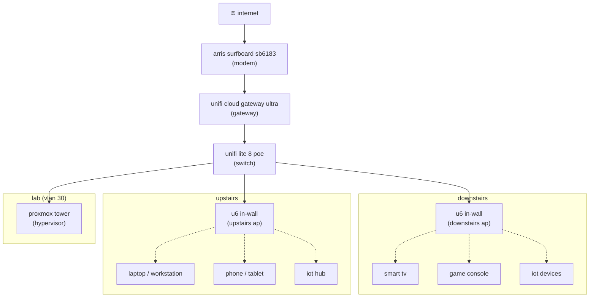
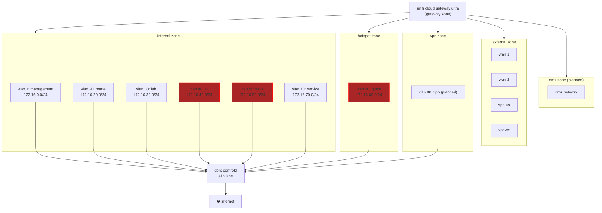

# network

networking is the unsung hero and backbone of the lab.

---

## design decisions

* 🛡️ **segmentation first:** each network is isolated by purpose, with
default-deny between zones, to reduce blast radius and enforce least-privilege
access.

* 🌐 **split-horizon dns:** internal resolution allows private names like
`gateway.morethq.com` to resolve while public services resolve via controld
using dns-over-https (doh).

* 🕵️‍♂️ **vpn for outbound traffic:** all traffic leaving the lab routes through
proton vpn to preserve privacy.

* 🏗️ **enterprise patterns at home:** over-segmentation, strict firewalling, and
tls coverage create a safe, realistic playground.

---

## hardware

* modem: arris - surfboard sb6183
* gateway: unifi cloud gateway ultra
* switch: unifi lite 8 poe
* access points:
    * (2) unifi u6 in-wall

    
network infrastructure diagram

---

## segmentation

the network is segmented into 6 trust zones, with a default of deny. there are
currently 7 vlans, each with their own subnet.

zones:

| zone       | associated vlans      | description                            |
| ---------- | --------------------- | -------------------------------------- |
| internal   | 1, 20, 30, 40, 50, 70 | trusted internal networks              |
| external   | wan 1, wan 2, vpn-xx  | internet uplinks and vpn clients       |
| gateway    | gateway               | gateway; enforces firewall rules       |
| vpn        | tbd                   | vpn servers; encrypted inbound traffic |
| hotspot    | 60                    | guest wi-fi; internet-only access      |
| dmz        | tbd                   | future public zone; extreme isolation  |

vlans:

| vlan | purpose    | subnet         | notes                                  |
| ---- | ---------- | -------------- | -------------------------------------- |
| 1    | management | 172.16.0.0/24  | gateway, aps                           |
| 20   | home       | 172.16.20.0/24 | personal devices                       |
| 30   | lab        | 172.16.30.0/24 | experimental services, containers      |
| 40   | iot        | 172.16.40.0/24 | smart devices, internet-only, isolated |
| 50   | work       | 172.16.50.0/24 | work device, internet-only, isolated   |
| 60   | guest      | 172.16.60.0/24 | guest wifi, internet-only, isolated    |
| 70   | service    | 172.16.70.0/24 | internal production apps, media, sync  |

* all outbound traffic goes through proton vpn via udp.
* all dns queries go through controld via doh.
* vlans 40 (iot), 50 (work), and 60 (guest) are strictly internet-only,
entirely isolated from internal resources.
* vlans 1 (mgmt), 20 (home), 30 (lab), and 70 (service) have internal routing
as needed.

    
network segmentation diagram

---

## proxmox trunk port

the proxmox tower connects to the switch via a trunk port on **port 8** of the
unifi lite 8 poe with the following vlan policy:

* **native (untagged): vlan 30 (lab)** — proxmox host management traffic rides
  untagged. the switch enforces vlan 30 implicitly. no vlan sub-interface needed
  on the host.

* **tagged: vlan 70 (service)** — vms destined for the service network carry an
  explicit vlan 70 tag set on the proxmox network device.

* **vlan 30 vms (e.g. devbox-nick)** — also ride native (no explicit tag). this
  is intentional: any accidental untagged traffic lands on vlan 30 (lab), not
  vlan 70 (service) or any other sensitive segment. the switch is the boundary,
  not individual vm configs.

**tradeoff accepted:** vlan 30 vms can't carry an explicit tag — they're
indistinguishable from host management traffic at the switch level. acceptable
for a lab-tier threat model. revisit if vlan 30 ever holds sensitive workloads.
